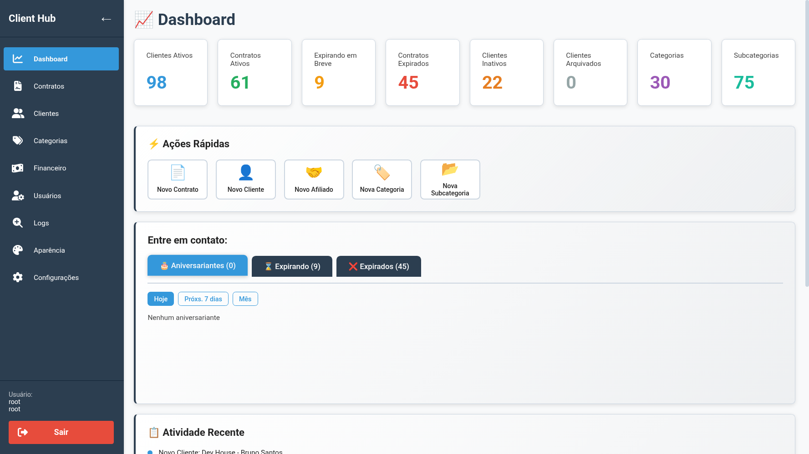
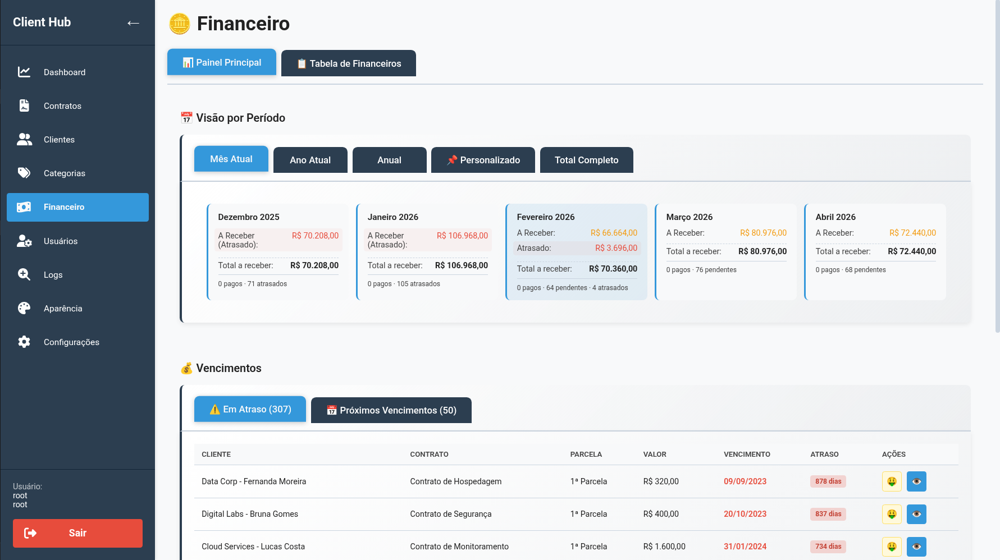
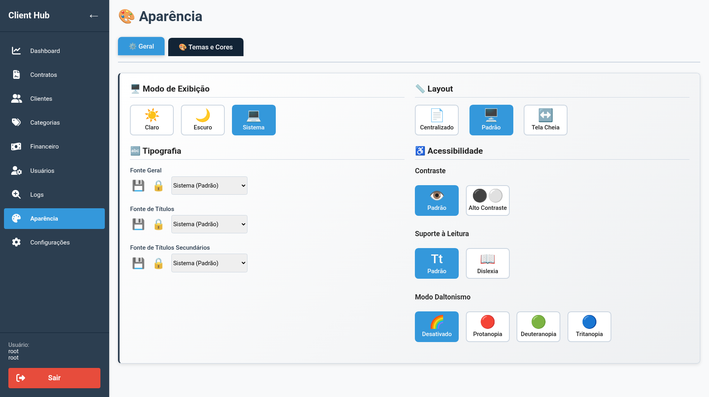
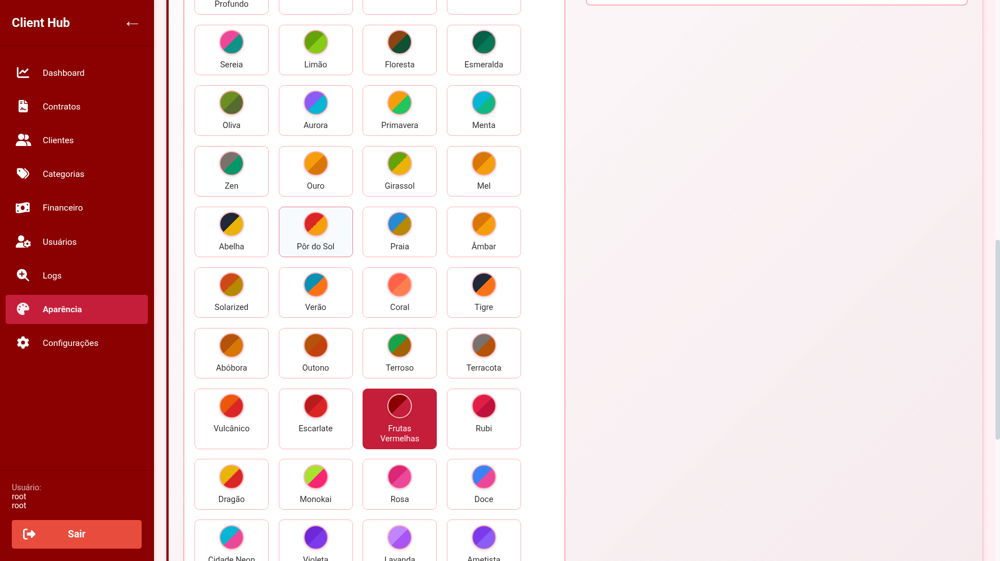

# Client Hub Open Project

[](https://www.gnu.org/licenses/agpl-3.0)
[](https://golang.org)
[](https://reactjs.org)
[](https://www.postgresql.org)
[](https://www.docker.com)
[](https://github.com/features/actions)
[](https://github.com/gabrielng-rj99/Client-Hub-Open-Project/graphs/contributors)
[](https://github.com/gabrielng-rj99/Client-Hub-Open-Project/stargazers)

> **Transparent Governance & Client Management for the Modern Organization.**  
> A highly secure, customizable, and audit-ready platform designed to manage complex connections between clients, contracts, and affiliates. Built with cutting-edge technologies and best practices in mind.

 <!-- Replace with actual banner if available -->

## 🌟 Why Client Hub?

Client Hub stands out as a robust, enterprise-grade solution for organizations needing to manage intricate client ecosystems. Whether you're handling multinational corporations with multiple subsidiaries or tracking complex contract lifecycles, Client Hub provides the tools you need with uncompromising security and transparency.

### Key Highlights
- **🔒 Zero-Trust Security**: Advanced RBAC, JWT fingerprinting, and progressive brute-force protection
- **📊 Audit-Ready**: Every mutation is logged with full snapshots for compliance and traceability
- **🏢 Hierarchical Management**: Clients, branches, affiliates, and contracts in a structured hierarchy
- **🎨 Fully Customizable**: Whitelabeling, themes, and configurable dashboards
- **🚀 Production-Ready**: Docker-based deployment with automated backups and migrations

## ✨ Features

### Core Functionality
- **👥 User Management**: Multi-role system (Root, Admin, User, Viewer) with granular permissions
- **🏢 Client Hierarchy**: Manage clients with unlimited affiliates and subsidiaries
- **📄 Contract Lifecycle**: Track contracts with categories, subcategories, and expiration alerts
- **💰 Financial Tracking**: Handle unique, recurring, and custom financial arrangements with installment management
- **🔍 Advanced Audit Logs**: Detailed history with diffs for all changes
- **📁 File Uploads**: Secure document management with access controls
- **🎛️ System Settings**: Configurable security policies, dashboard layouts, and notifications

### Security & Compliance
- **🛡️ Rate Limiting & Brute Force Protection**: Token bucket algorithm with progressive lockouts
- **🔐 Password Policies**: Role-based entropy requirements and history tracking
- **📋 Session Management**: Configurable timeouts and concurrent session limits
- **🔒 Data Encryption**: Secure storage with proper key management
- **📊 Compliance Logging**: Full audit trail for regulatory requirements

### Developer Experience
- **🐳 Docker-First**: Complete containerization with multi-stage builds
- **🧪 Comprehensive Testing**: Unit, integration, and E2E tests with pytest (Python)
- **📚 Extensive Documentation**: API docs, architecture guides, and deployment manuals
- **🔧 CLI Tools**: Migration runners, backup utilities, and development helpers

## 📸 Screenshots

| | |
|---|---|
| **Dashboard**<br> | **Financial Management**<br> |
| **Accessibility Panel**<br> | **Theme Customization**<br> |

## 🏗️ Architecture Overview

Client Hub follows a modern, layered architecture designed for scalability, maintainability, and security.

### System Architecture
```
┌─────────────────────────────────────────────────────────────┐
│                    Frontend (React + Vite)                  │
│              TypeScript, TailwindCSS, React Router          │
├─────────────────────────────────────────────────────────────┤
│                     API Gateway (NGINX)                     │
├─────────────────────────────────────────────────────────────┤
│                      Backend (Go 1.25.1)                    │
│  ┌─────────────┐  ┌─────────────┐  ┌─────────────────────┐  │
│  │   Handlers  │  │ Middleware  │  │   JWT Auth          │  │
│  │   (HTTP)    │  │ (CORS/Auth) │  │   (Token Mgmt)      │  │
│  └──────┬──────┘  └──────┬──────┘  └──────────┬──────────┘  │
│         │                │                     │            │
│  ┌──────┴────────────────┴─────────────────────┴──────────┐ │
│  │                     Store Layer                        │ │
│  │  (Business Logic + Data Access + Validations)          │ │
│  └────────────────────────┬───────────────────────────────┘ │
│                           │                                 │
│  ┌────────────────────────┴───────────────────────────────┐ │
│  │                  Domain Models                         │ │
│  │            (User, Client, Contract, etc.)              │ │
│  └────────────────────────────────────────────────────────┘ │
├─────────────────────────────────────────────────────────────┤
│                    PostgreSQL 16 Database                   │
│  Modular Schema with Migrations & Automated Backups         │
└─────────────────────────────────────────────────────────────┘
```

### Tech Stack
- **Backend**: Go 1.25.1 with Gin framework, Repository pattern, Clean Architecture
- **Frontend**: React 18 with Vite, TypeScript, FontAwesome icons
- **Database**: PostgreSQL 16 with modular schema and migrations
- **Deployment**: Docker Compose with NGINX reverse proxy
- **Testing**: Go tests, Vitest, Python/pytest E2E & security tests
- **Security**: JWT with per-user signing, rate limiting, CORS

### Database Schema
The database is organized into 8 modular components:
1. **Extensions**: citext for case-insensitive text
2. **Core**: Settings, roles, permissions
3. **Security**: Password/session policies
4. **Users**: User management and themes
5. **Clients**: Client and affiliate hierarchies
6. **Contracts**: Categories, subcategories, contracts
7. **Audit**: Comprehensive logging system
8. **Financial**: Payment tracking and installments

## 🚀 Getting Started

### Prerequisites
- Docker & Docker Compose
- Git
- (Optional) Go 1.25.1 and Node.js 24 for local development

### Quick Start with Docker

1. **Clone the repository**
   ```bash
   git clone https://github.com/gabrielng-rj99/Client-Hub-Open-Project.git
   cd Client-Hub-Open-Project
   ```

2. **Set up environment variables**
   ```bash
   cp deploy/docker/.env.example deploy/docker/.env
   # Edit .env with your configuration
   ```

3. **Deploy with the Manager Script**
   ```bash
   cd deploy
   make build
   ./bin/deploy-manager
   # Select Option 10: Full Docker Stack
   ```

4. **Access the application**
   - Frontend: http://localhost:8081
   - API: http://localhost:3000
   - Database: localhost:5432

### Development Setup

The project includes automated development scripts for easy setup.

#### Prerequisites
- Go 1.25.1+
- Node.js 24+
- PostgreSQL 16+
- Make

#### Setup Steps

1. **Start Development Environment**
   ```bash
   cd deploy/dev
   make start
   ```

   This will:
   - ✅ Automatically start PostgreSQL
   - ✅ Build and start the backend (Go)
   - ✅ Install dependencies and start the frontend (Vite)
   - ✅ Initialize the database schema
   - ✅ Create a root admin user

2. **Access the Application**
   - Frontend: http://localhost:45173 (hot reload)
   - Backend API: http://localhost:43000
   - Health Check: http://localhost:43000/health

3. **Useful Commands**
   ```bash
   # Stop all services
   make stop

   # Restart all services
   make restart

   # View logs
   make logs          # Backend logs
   make logs-frontend # Frontend logs

   # Check status
   make status

   # Clean environment
   make clean
   ```

For detailed documentation, see [deploy/dev/INICIO-RAPIDO.md](deploy/dev/INICIO-RAPIDO.md).

## 📖 Documentation

Comprehensive documentation is available in the `docs/` directory:

- [**API Reference**](docs/APIs.md) - Complete endpoint documentation
- [**Architecture Guide**](docs/ARCHITECTURE.md) - System design and patterns
- [**Deployment Manual**](deploy/README.md) - Production setup and configuration
- [**Contributing Guide**](docs/CONTRIBUTING.md) - Development workflow
- [**Security Policy**](docs/SECURITY.md) - Security best practices
- [**Code of Conduct**](docs/CODE_OF_CONDUCT.md) - Community guidelines

## 🧪 Testing

Client Hub maintains high code quality with comprehensive testing:

```bash
# Backend tests
cd backend
go test ./...

# Frontend unit tests
cd frontend
npm run test:unit

# E2E tests
npm run test:e2e
```

## 🤝 Contributing

We welcome contributions from developers of all skill levels! Here's how to get started:

1. **Fork the repository**
2. **Create a feature branch**: `git checkout -b feature/amazing-feature`
3. **Follow our coding standards**: Clean Architecture, SOLID principles
4. **Write tests**: Ensure all new code is covered
5. **Submit a PR**: Include a clear description and link to any related issues

### Development Guidelines
- **Security First**: All code must pass security reviews
- **Documentation**: Update docs for any API changes
- **Testing**: Maintain >80% test coverage
- **Code Style**: Follow Go and React best practices

## License

This project is licensed under the **GNU Affero General Public License v3.0 (AGPL-3.0)**.

The AGPL-3.0 is a strong copyleft license that ensures if you improve this software and provide it as a service (SaaS), you **must** share your improvements back with the community.

For more details, see [LICENSE](LICENSE) and [AGPL-3.0](https://www.gnu.org/licenses/agpl-3.0).

## 🙏 Acknowledgments

- **Contributors**: Thanks to all who have contributed to making Client Hub better
- **Open Source Community**: For foundational code and collaboration
- **Security Researchers**: For helping keep our code secure

## 📞 Support

- **Issues**: [GitHub Issues](https://github.com/gabrielng-rj99/Client-Hub-Open-Project/issues)
- **Discussions**: [GitHub Discussions](https://github.com/gabrielng-rj99/Client-Hub-Open-Project/discussions)
- **Security**: See [SECURITY.md](docs/SECURITY.md) for vulnerability reporting

---

**Client Hub Open Project** - Empowering organizations with transparent, secure client management.  
Built with ❤️ by the open source community.
